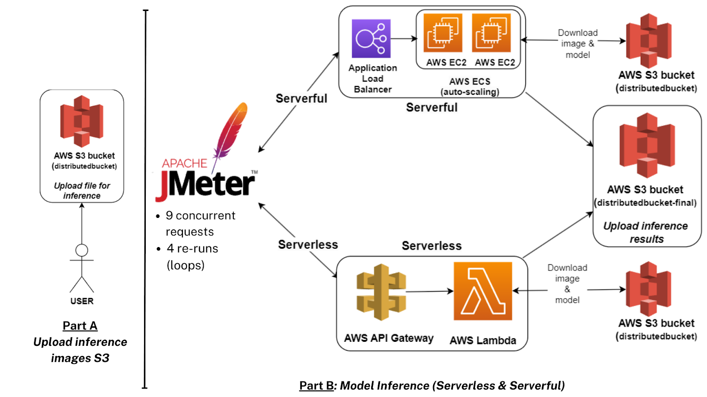
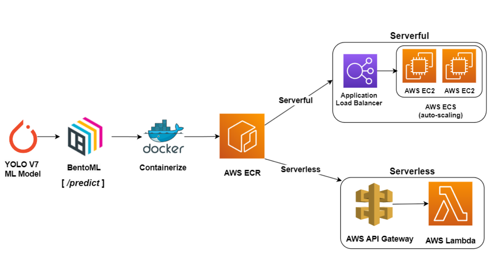
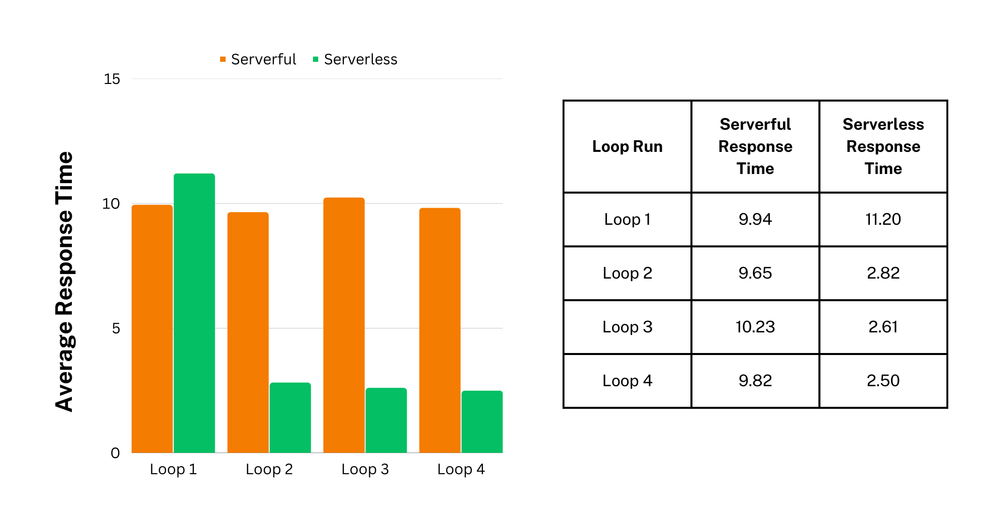
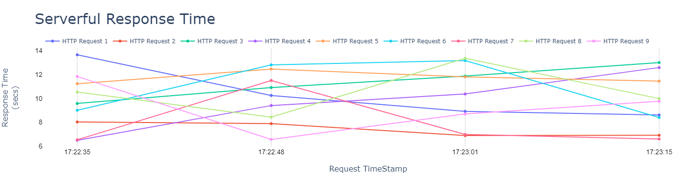
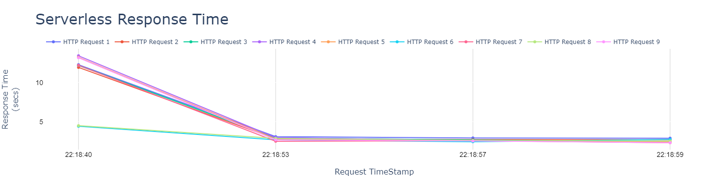

# Introduction
The project **Comparing Serverless and Serverful Performance for a Machine Learning Application using Microservices architecture** was implemented for the course CMPT 756. We used the Amazon Web Services (AWS) as our cloud platform to deploy our application.
  

# Table of Contents
- [System Design](#System-Design)
	- [Components](#Components)
		- [Serverful](#Serverful)
		- [Serverless](#Serverless)
		- [Storage](#Storage)
 - [Implementation](#Implementation)
	 - [Prediction Microservice](#Prediction-Microservice) 
 	 - [Deployment](#Deployment) 
	 	 - [Serverful Deployment](#Serverful-Deployment) 
	 	 - [Serverless Deployment](#Serverless-Deployment) 
- [Results & Analysis](#Results-&-Analysis)
	 - [Tests](#Tests) 
	 - [Results](#Results) 
		 - [Response time comparison](#Response-time-comparison)
		 - [Response Time Graphs](#Response-Time-Graphs)
 - [Report](#Detailed-Report)
 - [Authors](#Authors)	
  

# System Design
We built and hosted a prediction microservice with one API endpoint (“/predict”) for an object-detection task. An image is uploaded in the S3 bucket (bucket name: “distributedbucket”), and the image filename is passed to the API endpoint in the request body while making the API call. The API endpoint downloads the respective image from an S3 bucket predicts the bounding box for all the respective objects in the image along with the confidence score, and uploads the resultant image to another S3 bucket (bucket name: “distributedbucket-final”). The endpoint returns the S3 public URL of the resultant image.

  
<u>Figure:</u> &nbsp;<em>System Design</em>

 

## Components

### Serverful
For serverful, we deployed the containerized application (stored in ECR) on a cluster of EC2 instances. We managed the cluster using AWS Elastic Container Service (ECS) and used auto-scaling for EC2 scale-in and scale-out. We connected an Application Load Balancer (ALB) to the cluster for providing access to the application endpoint.

### Serverless
For serverless, we deployed the containerized application (stored in ECR) onto AWS Lambda service (serverless computing) and connected an AWS API Gateway with the Lambda service for providing access to the application endpoint.

### Storage
For storage, we created two S3 buckets - “distributedbucket” and “distributedbucket-final”. “Distributedbucket” was used for storing model weight files and input images, and “distributedbucket-final” was used to store the output images. Both EC2 instances in the cluster and Lambda functions had access to the respective S3 buckets.
  

# Implementation
## Prediction Microservice
We used the official COCO dataset pre-trained PyTorch-based YOLO V7 (YOLOv7-W6 model version) object-detection model. We developed a microservice with the “/predict” endpoint in the BentoML framework. The microservice downloads the input image (given in the request body) and model from “distributedbucket” S3 bucket, runs the YOLO V7 model, uploads the output to the “distributedbucket-final” S3 bucket, and returns the public URL of the output image (stored in the S3 bucket) in the response body. We containerized the application using the Docker tool and stored the containerized application in AWS ECR. 
 

## Deployment

  
<u>Figure:</u> &nbsp;<em>Deployment Diagram Serverless vs Serverful</em>

### Serverful Deployment
For our serverful deployment, we used the AWS UI to deploy our containerized application on a cluster of EC2 instances and the cluster was managed using ECS. The configured auto-scaling in ECS with a minimum of 1 and a maximum of five EC2 instances. We set the scale-out criteria “CpuPercentageUsage” to 70%, and for scale-in, we used idleSystemTime of an EC2 instance i.e. delete an EC2 instance if idle for more than 1 minute. We configured and connected an Application Load Balancer (ALB) to the cluster for providing access to the application endpoint. We used the t3a.xlarge general-purpose EC2 instance type for our experiments.

### Serverless Deployment
For our Serverless Deployment on AWS Lambda, we used Bentoctl, a CLI tool built on top of BentoML for deploying our containerized application onto AWS Lambda and connected an AWS API Gateway with the Lambda service for providing access to the application endpoint. We set the Lambda function memory to 3000 MB and the timeout to 30 secs.
  

# Results & Analysis
## Tests
- We have compared serverless and serverful deployment using the response time. We performed load testing using the open-source tool Apache Jmeter which returns the response times for each request to our application. For our experiment, we uploaded 20 random images from the COCO dataset to "distributedbucket” S3 bucket for testing purposes. We spawned 9 concurrent requests in one batch of requests and re-ran the batch 4 times for both serverless and serverful.  
- The Apache JMeter Test file - [JMeter JMX Test File](JMeter_Load_Testing.jmx)
  

## Results
### Response time comparison
For serverful (the EC2 cluster), we obtained the optimal results with 2 t3a.xlarge EC2 instances. We started with 1 default EC2 instance which auto-scaled itself to add one more EC2 instance of the respective type to handle the application load.

### Response Time Graphs
#### Response Time Graphs: Serverful vs Serverless

  
<u>Figure:</u> &nbsp;<em>Average Response Time Comparison (Serverless vs Serverful)</em>

 

#### Complete Response Time Graph

<h4 align="center" style='padding-bottom: 10px'>
<b>vs</b>
</h4>
  
  
<u>Figure:</u> &nbsp;<em>Response Time Comparison (Serverless vs Serverful)</em>

  
We chose an ML application so that we could evidently showcase a significant difference between the serverless and serverful response times. For the serverless, we saw the problem of cold-starting as the first batch of requests (timestamp: 22:18:40) had an average 11 sec response time but the subsequent requests had less than 3 secs response time. Moreover, AWS Lambda uses a default in-built caching mechanism which is not present in the EC2 cluster which could also lead to lower response times in Lambda functions as compared with EC2 cluster. For the serverful, we saw that all the requests across various batch runs had a consistent response time i.e. response time was between 6 to 14 secs. The reason behind such a response time range for serverful is that current requests have to wait for existing requests to be completed.
  

# Detailed Report
CMPT 756 Final Project Report - [Download](assets/Group_12_Final_Report.pdf)

 

# Authors
- [Karan Pathak](https://www.github.com/karanpathak)
- [Brij Bhatia](https://github.com/brij1197)
- [Poornima Bhat](https://github.com/PoornimaBhat29)
- [Kajori Roy](https://github.com/Kajori21)
- [Manogna Venkat](https://github.com/ManognaVenkat)
